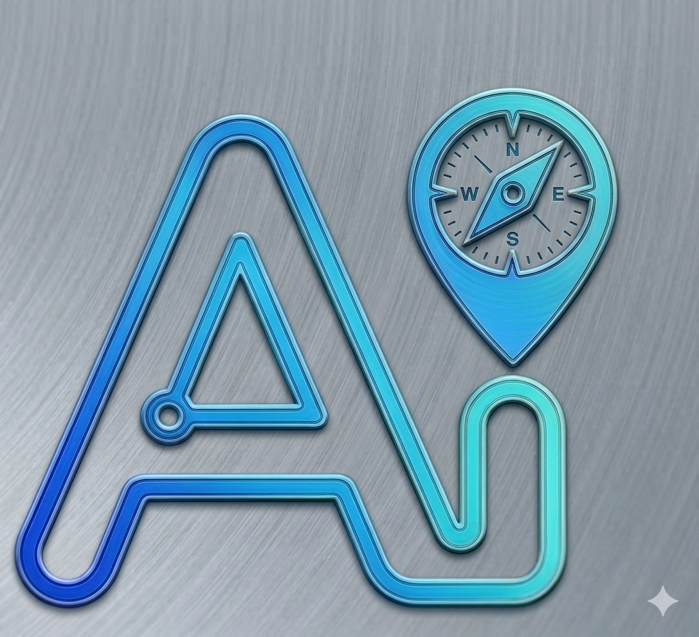

<p align="center">
  
</p>

# AI Assistant

A full-stack AI chat application built with React, Express, MongoDB, and an AI inference API. Users can sign up, log in, create chat threads, and send prompts that are stored in MongoDB and answered by the backend using a model endpoint.

- Live demo: https://ai-assistant-nsg8.onrender.com/
- Repository: https://github.com/Harkit07/AI-Assistant

## Overview

This project is split into two independent apps:

- Frontend: React + Vite app for the chat UI
- Backend: Express API for authentication, thread management, and AI chat completion handling

## Current Status

The backend AI integration has been updated to handle both streaming and non-streaming responses from the NVIDIA OpenAI-compatible endpoint and to validate the required API key before making requests.

The targeted backend tests now pass:

```bash
cd Backend
node --test utils/openai.test.js
```

This means the core AI utility is working for local development and validation flows. However, production deployment still requires environment hardening, security review, and live deployment validation before being treated as fully production-ready.

The app supports:

- User signup and login with JWT authentication
- Protected chat routes
- Thread-based conversation history per user
- Responsive sidebar + chat layout
- Live-streamed AI replies with Markdown rendering
- English replies by default; Hindi replies when explicitly requested
- User-facing toast notifications for AI provider rate limits or empty replies
- MongoDB persistence for user data and chat threads
- Docker and Kubernetes deployment support

## Tech Stack

### Frontend

- React 19
- Vite
- Axios
- react-markdown
- Tailwind CSS
- react-toastify

### Backend

- Node.js
- Express 5
- MongoDB + Mongoose
- JWT authentication
- bcrypt password hashing
- OpenAI-compatible NVIDIA inference endpoint
- serverless-http for Netlify compatibility

## Repository Structure

```text
AI-Assistant/
├── .github/
│   └── workflows/
│       └── deploy.yml
├── Backend/
│   ├── .env.example
│   ├── models/
│   │   ├── Thread.js
│   │   ├── blacklistToken.js
│   │   └── user.js
│   ├── netlify/
│   │   └── functions/
│   │       └── server.js
│   ├── routes/
│   │   ├── chat.js
│   │   └── user.js
│   ├── services/
│   │   ├── user.js
│   │   └── validationResult.js
│   ├── utils/
│   │   └── openai.js
│   ├── middleware.js
│   ├── server.js
│   ├── Dockerfile
│   ├── netlify.toml
│   └── package.json
├── Frontend/
│   ├── .env.example
│   ├── public/
│   │   ├── Img.png
│   │   └── Logo.png
│   ├── src/
│   │   ├── App.jsx
│   │   ├── AuthContext.jsx
│   │   ├── Chat.jsx
│   │   ├── ChatContext.jsx
│   │   ├── ChatWindow.jsx
│   │   ├── Login.jsx
│   │   ├── Sidebar.jsx
│   │   ├── UIContext.jsx
│   │   ├── MyContext.jsx
│   │   └── main.jsx
│   ├── index.html
│   ├── Dockerfile
│   ├── package.json
│   ├── vite.config.js
│   └── eslint.config.js
├── k8s/
│   ├── backend-deployment.yaml
│   ├── frontend-deployment.yaml
│   ├── ingress.yaml
│   └── secrets.yaml
├── docker-compose.yml
├── .gitignore
├── README.md
└── .github/
```

## Features

- JWT-based user authentication and protected routes
- Signup/login flow with validation
- Chat history stored per user and per thread
- Conversation thread creation, listing, and deletion
- The last 20 messages in a thread are sent as context for each AI reply
- AI reply generation through NVIDIA's OpenAI-compatible inference endpoint
- AI response tokens are streamed from the backend to the frontend using Server-Sent Events (SSE)
- Markdown output rendering and syntax highlighting in the frontend
- Responses default to English; the assistant uses Hindi when the user explicitly requests it
- Responsive layout for desktop and mobile screens
- Dockerized local development and deployment setup
- Kubernetes manifests for orchestration

## Prerequisites

Before running the project locally, make sure you have:

- Node.js 18+ recommended
- npm
- MongoDB instance or MongoDB Atlas database
- AI API key for the backend inference call

## Environment Variables

### Backend

Copy `Backend/.env.example` to `Backend/.env` and update the values for your setup:

```env
MONGODB_URI=mongodb+srv://<username>:<password>@cluster.mongodb.net/ai-assistant
JWT_SECRET=change-me-to-a-long-random-secret
OPENAI_API_KEY=your-ai-api-key
CLIENT_URL=http://localhost:5173
NODE_ENV=development
PORT=8080
```

Notes:

- The backend calls `mongoose.connect(process.env.MONGODB_URI)`, so `MONGODB_URI` is required.
- `CLIENT_URL` is used in CORS allowlist.
- `OPENAI_API_KEY` must contain a valid NVIDIA API key for the configured inference endpoint.
- The backend AI helper includes a streaming SSE flow and a JSON fallback path for non-streaming provider responses.

### Frontend

Copy `Frontend/.env.example` to `Frontend/.env` before running the app:

```env
VITE_BASE_URL=http://localhost:8080
```

This value is used by the React app to call backend endpoints like `/user/login`, `/user/signup`, `/api/thread`, and `/api/chat`.

## Running Locally

### 1) Start the backend

```bash
cd Backend
npm install
node server.js
```

The backend is served on:

- http://localhost:8080

### 2) Start the frontend

```bash
cd Frontend
npm install
npm run dev
```

The frontend is served on:

- http://localhost:5173

## API Endpoints

### Auth Routes (`/user`)

| Method | Route | Auth | Description |
| --- | --- | --- | --- |
| POST | `/user/signup` | ❌ | Register a new user |
| POST | `/user/login` | ❌ | Log in and receive a JWT |
| GET | `/user/profile` | ✅ | Fetch the authenticated user |
| GET | `/user/logout` | ✅ | Log out and clear the token |

### Chat Routes (`/api`)

| Method | Route | Auth | Description |
| --- | --- | --- | --- |
| GET | `/api/thread` | ✅ | Fetch all user threads |
| GET | `/api/thread/:threadId` | ✅ | Fetch messages in a thread |
| DELETE | `/api/thread/:threadId` | ✅ | Delete a thread |
| POST | `/api/chat` | ✅ | Send a user message and receive a streamed AI reply |

`POST /api/chat` returns a `text/event-stream` response. Each event is sent as
`data: {"token":"..."}` while the model generates its reply. A successful
completion ends with `data: {"done":true}`. If the AI provider fails after
streaming starts, the stream contains an `error` event; the frontend displays
a toast for rate-limit and empty-response errors.

The endpoint uses the last 20 messages in the thread as context. The system
instruction asks the model to answer in English by default and to use Hindi
only when explicitly requested.

## Tests

Run the backend inference request and streaming parser tests with:

```bash
cd Backend
node --test utils/openai.test.js
```

## Docker

The project includes Docker files for both the backend and frontend.

### Build and run with Docker Compose

```bash
docker-compose up --build
```

This starts the backend, frontend, and MongoDB services together.

## Kubernetes

The `k8s/` folder contains deployment manifests for:

- backend deployment
- frontend deployment
- ingress rules
- secrets

Example commands:

```bash
kubectl apply -f k8s/backend-deployment.yaml
kubectl apply -f k8s/frontend-deployment.yaml
kubectl apply -f k8s/ingress.yaml
```

## CI/CD

The GitHub Actions workflow located at `.github/workflows/deploy.yml` builds Docker images for both apps and pushes them to Docker Hub when changes are pushed to `main`.

## Notes

- The backend uses `serverless-http` and includes a Netlify setup in `Backend/netlify.toml`.
- For Netlify deployments, configure `MONGODB_URI`, `JWT_SECRET`, `OPENAI_API_KEY`, and `CLIENT_URL` as site environment variables, then redeploy the site.
- The frontend is configured with `VITE_BASE_URL`, not `VITE_API_URL`.
- Production usage requires secure environment variables, a real MongoDB + AI provider setup, and deployment-level hardening checks.
- The project is validated for local development and targeted backend correctness checks, but additional production validation is still recommended before live release.

## License

This project is open source and intended for learning, experimentation, and personal use.
